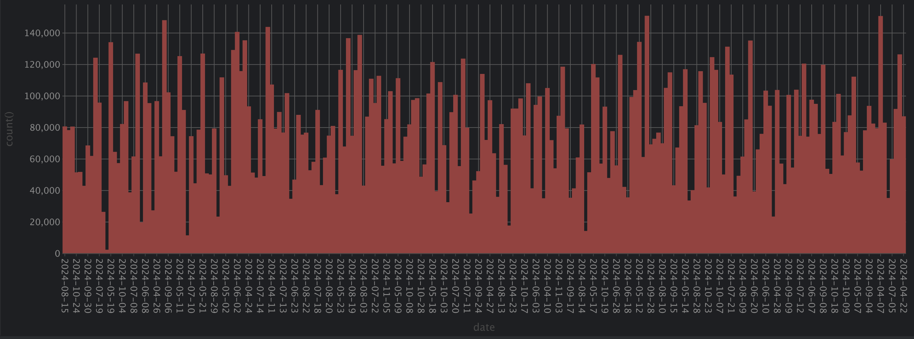
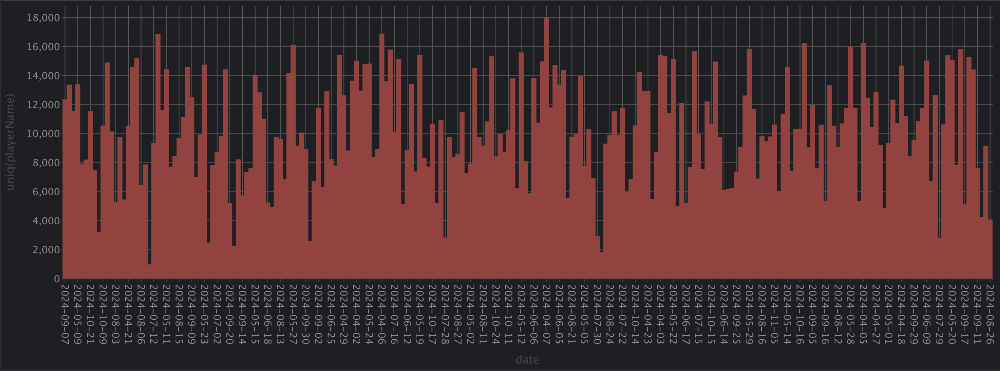
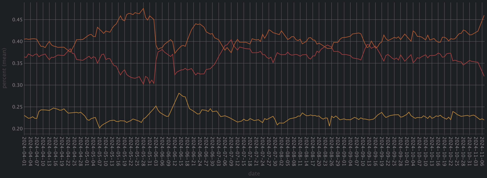
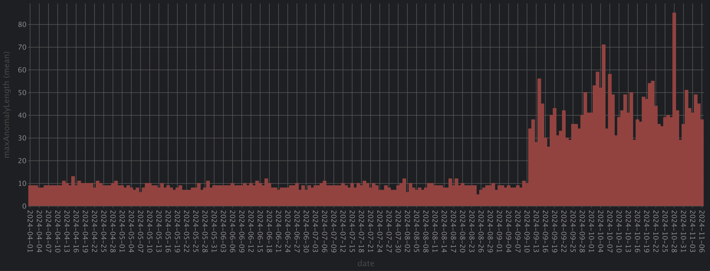
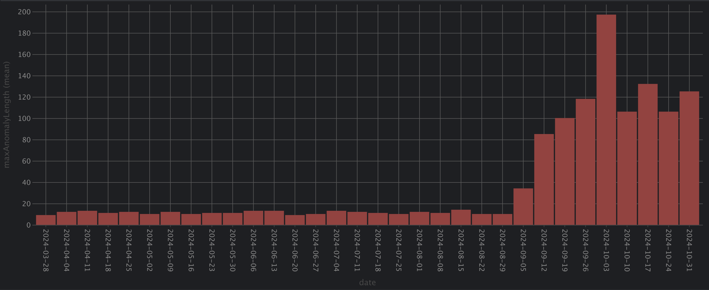
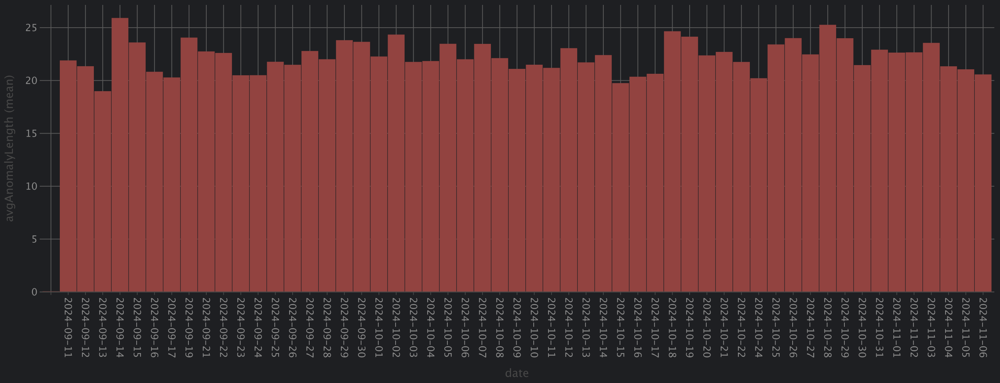
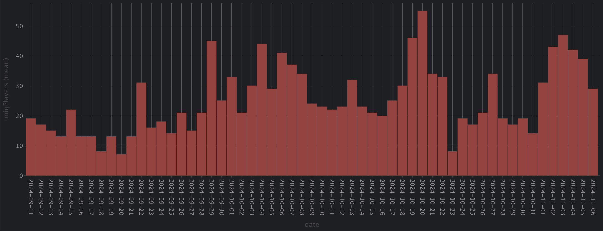

# Баг на аномальные сессии Мир Танков 2024

> [!NOTE]
> **Аномальная сессия** – последовательность боёв у одного игрока, в которых он играя на 10 уровне **не попадал** в бои 12 уровня (весь бой состоит только из танков 10 уровня)

## Краткое описание
С первого дня ввода танков `11` уровня в рандом (11.09.2024) появился баг балансировщика, из-за которого, некоторые игроки, переставали попадать в бои 12 уровня (весь бой состоит из танков 10 уровня) на чрезмерно длинные сессии.
> [!NOTE]
> Например `C1yMba` не попадал в бои 12 уровня на протяжение 86 боёв **подряд** прямо на стриме.  
> В это время, бои 12 уровня составляли 70% от всех сыгранных боёв на танках 10 уровня.

## Источник данных
Данные собираются среди игроков установивших мод.

База данных [wotstat.info](https://wotstat.info/) 
- Интервал дат: `01.04.2024` - `06.10.2024`.
- Уровень танков: `10`.
- Регион: `RU`.
- Тип боя: `REGULAR` (стандартный бой).

Количество **боёв** на выбранном промежутке: `~60k` ежедневно. Распределены равномерно.



Количество **игроков** на выбранном промежутке: `~8k` ежедневно. Распределены равномерно.



Количество **боёв по уровню** на выбранном промежутке среди 8, 9 и 10 уровней. Распределены равномерно, аномалий нет.

- оранжеовый - 10 уровень
- жёлтый - 9 уровень
- красный - 8 уровень

## Количество аномальных сессий

### Максимальное количество боёв в аномальной сессии среди всех игроков.

По графику видно, что до 11.09.2024 максимальная длина аномальных сессий **не превышала 15 боёв**. После 11.09.2024, максимальная длина аномальных сессий **превышает 30 боёв** и доходит до **80 боёв** в день (подряд).

#### В разбивке по неделям


### Средняя длина аномальных сессий в день.
Рассмотрим аномальные сессии длиной более 15 боёв.
> [!NOTE]
> График начинается с 11.09.2024, ранее таких сессий не было.


Средняя длина аномальных сессий составляет 20 боёв.

### Количество игроков, попавших в аномальные сессии в день.
Около 25 игроков в день попадают в аномальные сессии.
> [!NOTE]
> **Среди пользователей мода**. Данных слишком мало, чтобы делать выводы о всех игроках.



# Итог
Аномальные сессии длинной более 15 боёв начали фиксироваться с 11.09.2024.
- Количество: `2200`
- Средняя длина: `28 боёв`
- Максимальная длина: `385 боёв`
- Всего игроков: `1583`

### Примеры сессий
| Никнейм           | Длина (боёв)     | Длина (дней) | Сервера            | Танки                                            | Ссылка                                                                                                                                                                                                                                                                                                                                                                                                                                                                                                                                                         |
| ----------------- | ---------------- | ------------ | ------------------ | ------------------------------------------------ | -------------------------------------------------------------------------------------------------------------------------------------------------------------------------------------------------------------------------------------------------------------------------------------------------------------------------------------------------------------------------------------------------------------------------------------------------------------------------------------------------------------------------------------------------------------- |
| Aleko             | 385              | 44           | `1`, `2`, `4`, `6` | `ИС-4`, `Maus`, `Об. 261`                        | [Ссылка](https://wotstat.info/session/results?level=10&nickname=Aleko&from=2024-09-23T00:00:00.000Z&to=2024-11-07T00:00:00.000Z)                                                                                                                                                                                                                                                                                                                                                                                                                               |
| cherellobartok    | 364              | 52           | `2`, `4`, `6`      | `Об. 279 (р)`, `Об. 140`, `WT E 100`             | [Ссылка](https://wotstat.info/session/results?level=10&nickname=cherellobartok&from=2024-09-11T11:49:37.000Z&to=2024-11-03T00:00:00.000Z)                                                                                                                                                                                                                                                                                                                                                                                                                      |
| HAKyPu_KOTA_39RUS | 35, 197, 263, 30 | 1, 3, 11, 2  | `1`, `2`, `6`, `7` | `T95/FV4201`,     `Об. 780`,`Leopard 1` и другие | [Ссылка 1](https://wotstat.info/session/results?level=10&nickname=HAKyPu_KOTA_39RUS&from=2024-10-02T16:21:10Z&to=2024-10-02T21:52:26Z), [Ссылка 2](https://wotstat.info/session/results?level=10&nickname=HAKyPu_KOTA_39RUS&from=2024-10-03T11:28:04Z&to=2024-10-06T19:18:59Z), [Ссылка 3](https://wotstat.info/session/results?level=10&nickname=HAKyPu_KOTA_39RUS&from=2024-10-06T19:40:08Z&to=2024-10-17T20:52:08Z), [Ссылка 4](https://wotstat.info/session/results?level=10&nickname=HAKyPu_KOTA_39RUS&from=2024-10-18T17:59:50Z&to=2024-10-20T18:34:41Z) |
| C1yMba            | 86               | 1            | `1`, `2`           | `Wiedźmak`, `AMX 50 B`, `Maus`                   | [Cсылка](https://wotstat.info/session/results?level=10&nickname=C1yMba&from=2024-10-28T08:16:41Z&to=2024-10-28T22:27:25Z)                                                                                                                                                                                                                                                                                                                                                                                                                                      |

Ознакомиться с полным актуальным списком игроков вы можете [тут](https://db.wotstat.info/play?user=public#d2l0aAogICAgZGF0YSBhcyAoCiAgICAgICAgc2VsZWN0IHBsYXllck5hbWUsCiAgICAgICAgICAgICAgIHRvU3RhcnRPZkludGVydmFsKGRhdGVUaW1lLCBpbnRlcnZhbCAxIHllYXIpIGFzIGRhdGUsCiAgICAgICAgICAgICAgIGdyb3VwQXJyYXkodmlzaWJsZUxldmVscyBpbiAoWzExLCAxMF0sIFsxMF0pKSBhcyBncm91cEJhdHRsZUxldmVsMTIsCiAgICAgICAgICAgICAgIGdyb3VwQXJyYXkoZGF0ZVRpbWUpIGFzIGRhdGVzLAogICAgICAgICAgICAgICBhcnJheVNvcnQodCAtPiB0LjEsIGFycmF5WmlwKGRhdGVzLCBncm91cEJhdHRsZUxldmVsMTIpKS4yIGFzIGZ1bGwxMiwKICAgICAgICAgICAgICAgY291bnQoKSBhcyBiYXR0bGVzQ291bnQsCiAgICAgICAgICAgICAgIGdyb3VwVW5pcUFycmF5KHRhbmtUYWcpIGFzIHRhbmtzLCBncm91cFVuaXFBcnJheShzZXJ2ZXJOYW1lKSBhcyBzZXJ2ZXJOYW1lcwogICAgICAgIGZyb20gRXZlbnRfT25CYXR0bGVSZXN1bHQKICAgICAgICB3aGVyZSBkYXRlVGltZSA+ICcyMDI0LTA5LTAxJyBhbmQgdGFua0xldmVsID0gMTAgYW5kIHJlZ2lvbiA9PSAnUlUnIGFuZCBiYXR0bGVNb2RlID0gJ1JFR1VMQVInCiAgICAgICAgZ3JvdXAgYnkgcGxheWVyTmFtZSwgZGF0ZQogICAgKSwKICAgIHNlcmllcyBhcyAoCiAgICAgICAgc2VsZWN0CiAgICAgICAgICAgIHBsYXllck5hbWUsIGRhdGUsIGJhdHRsZXNDb3VudCwgZnVsbDEyLCB0YW5rcywgc2VydmVyTmFtZXMsCiAgICAgICAgICAgIGFycmF5RmlsdGVyKHggLT4geCA+IDAsIGFycmF5TWFwKChpLCBmbGFnKSAtPiAoZmxhZyA9IDAgQU5EIChpID0gMSBPUiBmdWxsMTJbaSAtIDFdICE9IGZsYWcpKSA/IGkgOiAwLCBhcnJheUVudW1lcmF0ZShmdWxsMTIpLCBmdWxsMTIpKSBBUyBzZXJpZXNTdGFydHMsCiAgICAgICAgICAgIGFycmF5RmlsdGVyKHggLT4geCA+IDAsIGFycmF5TWFwKChpLCBmbGFnKSAtPiAoZmxhZyA9IDAgQU5EIChpID0gbGVuZ3RoKGZ1bGwxMikgT1IgZnVsbDEyW2kgKyAxXSAhPSBmbGFnKSkgPyBpIDogMCwgYXJyYXlFbnVtZXJhdGUoZnVsbDEyKSwgZnVsbDEyKSkgQVMgc2VyaWVzRW5kcwogICAgICAgIGZyb20gZGF0YQogICAgKSwKICAgIGFub21hbHlzIGFzICgKICAgICAgICBzZWxlY3QgcGxheWVyTmFtZSwgZGF0ZSwgYXJyYXlGaWx0ZXIodCAtPiB0ID4gMTUsIGFycmF5TWFwKChzLCBlKSAtPiBlIC0gcyArIDEsIHNlcmllc1N0YXJ0cywgc2VyaWVzRW5kcykpIGFzIGFub21hbHlTZXNzaW9uTGVuZ3RoLCBiYXR0bGVzQ291bnQKICAgICAgICBmcm9tIHNlcmllcwogICAgICAgIHdoZXJlIGxlbmd0aChhbm9tYWx5U2Vzc2lvbkxlbmd0aCkgPiAwCiAgICApCnNlbGVjdCBwbGF5ZXJOYW1lLCBhcnJheUZsYXR0ZW4oZ3JvdXBBcnJheShhbm9tYWx5U2Vzc2lvbkxlbmd0aCkpIGFzIHNlc3Npb25MZW5naHQKZnJvbSBhbm9tYWx5cwpncm91cCBieSBwbGF5ZXJOYW1lCm9yZGVyIGJ5IGFycmF5TWF4KHNlc3Npb25MZW5naHQpIGRlc2M7). Нужно нажать кнопку `Run`

Получить детальный анализ по конкретному игроку вы можете [тут](https://db.wotstat.info/play?user=public#d2l0aCAnQzF5TWJhJyBhcyBQTEFZRVJfTkFNRSwKICAgIGRhdGEgYXMgKAogICAgICAgIHNlbGVjdCBwbGF5ZXJOYW1lLAogICAgICAgICAgICAgICBhcnJheVNvcnQodCAtPiB0LjEsCiAgICAgICAgICAgICAgICAgICAgICAgICBhcnJheVppcChncm91cEFycmF5KGRhdGVUaW1lKSwgZ3JvdXBBcnJheSh2aXNpYmxlTGV2ZWxzIGluIChbMTEsIDEwXSwgWzEwXSkpLCBncm91cEFycmF5KHRhbmtUYWcpLCBncm91cEFycmF5KHNlcnZlck5hbWUpKQogICAgICAgICAgICAgICApIGFzIHNvcnRlZCwKICAgICAgICAgICAgICAgc29ydGVkLjEgYXMgZGF0ZXMsCiAgICAgICAgICAgICAgIHNvcnRlZC4yIGFzIGZ1bGwxMCwKICAgICAgICAgICAgICAgc29ydGVkLjMgYXMgdGFua3MsCiAgICAgICAgICAgICAgIHNvcnRlZC40IGFzIHNlcnZlck5hbWVzLAogICAgICAgICAgICAgICBjb3VudCgpIGFzIGJhdHRsZXNDb3VudAogICAgICAgIGZyb20gRXZlbnRfT25CYXR0bGVSZXN1bHQKICAgICAgICB3aGVyZSBkYXRlVGltZSA+ICcyMDI0LTA0LTAxJyBhbmQgdGFua0xldmVsID0gMTAgYW5kIHJlZ2lvbiA9PSAnUlUnIGFuZCBiYXR0bGVNb2RlID0gJ1JFR1VMQVInIGFuZCBwbGF5ZXJOYW1lID0gUExBWUVSX05BTUUKICAgICAgICBncm91cCBieSBwbGF5ZXJOYW1lCiAgICAgICAgaGF2aW5nIGJhdHRsZXNDb3VudCA+IDIwCiAgICApLAogICAgc2VyaWVzIGFzICgKICAgICAgICBzZWxlY3QKICAgICAgICAgICAgcGxheWVyTmFtZSwgYmF0dGxlc0NvdW50LCBmdWxsMTAsIGRhdGVzLCB0YW5rcywgc2VydmVyTmFtZXMsCiAgICAgICAgICAgIGFycmF5RmlsdGVyKHggLT4geCA+IDAsIGFycmF5TWFwKChpLCBmbGFnKSAtPiAoZmxhZyA9IDAgQU5EIChpID0gMSBPUiBmdWxsMTBbaSAtIDFdICE9IGZsYWcpKSA/IGkgOiAwLCBhcnJheUVudW1lcmF0ZShmdWxsMTApLCBmdWxsMTApKSBBUyBzZXJpZXNTdGFydHMsCiAgICAgICAgICAgIGFycmF5RmlsdGVyKHggLT4geCA+IDAsIGFycmF5TWFwKChpLCBmbGFnKSAtPiAoZmxhZyA9IDAgQU5EIChpID0gbGVuZ3RoKGZ1bGwxMCkgT1IgZnVsbDEwW2kgKyAxXSAhPSBmbGFnKSkgPyBpIDogMCwgYXJyYXlFbnVtZXJhdGUoZnVsbDEwKSwgZnVsbDEwKSkgQVMgc2VyaWVzRW5kcwogICAgICAgIGZyb20gZGF0YQogICAgKSwKICAgIHJhbmdlcyBhcyAoCiAgICAgICAgc2VsZWN0ICosIGFycmF5RmlsdGVyKHQgLT4gdC4yIC0gdC4xID4gMTUsIGFycmF5WmlwKHNlcmllc1N0YXJ0cywgc2VyaWVzRW5kcykpIGFzIHNlcmllcywKICAgICAgICAgICAgYXJyYXlNYXAodCAtPiByYW5nZSh0LjEsIHQuMiksIHNlcmllcykgYXMgcmFuZ2VzLAogICAgICAgICAgICBhcnJheU1hcChjdXJSYW5nZSAtPiBhcnJheUZpbHRlcigodCwgaSkgLT4gaGFzKGN1clJhbmdlLCBpKSwgYXJyYXlaaXAodGFua3MsIHNlcnZlck5hbWVzLCBkYXRlcyksIGFycmF5RW51bWVyYXRlKHRhbmtzKSksIHJhbmdlcykgYXMgdmFsdWVSYW5nZXMKICAgICAgICBmcm9tIHNlcmllcwogICAgKSwKICAgIHNlc3Npb25zIGFzICgKc2VsZWN0IGFycmF5TWFwKHQgLT4gYXJyYXlEaXN0aW5jdCh0KSwgdmFsdWVSYW5nZXMuMSkgYXMgdW5pcVRhbmtzLAogICAgICAgYXJyYXlNYXAodCAtPiBhcnJheVNvcnQoYXJyYXlEaXN0aW5jdCh0KSksIHZhbHVlUmFuZ2VzLjIpIGFzIHVuaXFTZXJ2ZXJzLAogICAgICAgYXJyYXlNYXAodCAtPiB0LjIgLSB0LjEgKyAxLCBzZXJpZXMpIGFzIHNlcmllc0xlbmd0aCwKICAgICAgIGFycmF5TWFwKHQgLT4gKGFycmF5TWluKHQpLCBhcnJheU1heCh0KSksIHZhbHVlUmFuZ2VzLjMpIGFzIHN0YXJ0cywKICAgICAgIGFycmF5TWFwKHQgLT4gY29uY2F0KCdodHRwczovL3dvdHN0YXQuaW5mby9zZXNzaW9uL3Jlc3VsdHM/bGV2ZWw9MTAmbmlja25hbWU9JywgUExBWUVSX05BTUUsICcmZnJvbT0nLCBmb3JtYXREYXRlVGltZSh0LjEsICclRlQlVFonKSwgJyZ0bz0nLCBmb3JtYXREYXRlVGltZSh0LjIsICclRlQlVFonKSksIHN0YXJ0cykgYXMgd290c3RhdFVybApmcm9tIHJhbmdlcykKc2VsZWN0IHdvdHN0YXRVcmwsCiAgICAgICBzZXJpZXNMZW5ndGgsCiAgICAgICBkYXRlRGlmZignZGF5Jywgc3RhcnRzLjEsIHN0YXJ0cy4yKSBhcyBkdXJhdGlvbiwKICAgICAgIHVuaXFUYW5rcywKICAgICAgIHVuaXFTZXJ2ZXJzCmZyb20gc2Vzc2lvbnMKYXJyYXkgam9pbiB1bmlxVGFua3MsIHVuaXFTZXJ2ZXJzLCBzZXJpZXNMZW5ndGgsIHdvdHN0YXRVcmwsIHN0YXJ0czs=). Нужно вписать на первую строку интересующий никнейм `with 'ВАШ_НИКНЕЙМ' as PLAYER_NAME` и нажать кнопку `Run`


### Аномальные сессии не прерываются
- Смена танка
- Смена сервера
- Презаход в игру
- Смена суток (перезапуск сервера)
- Вхвод и выход из взвода

> [!WARNING]
> Эти данные могут быть подвержены **ошибке выжившего**. Точно есть сессии которые не прерывались вышеуказанными событиями, но я не изучал наличие сессий которые прерывались*

> [!NOTE]
> На Wargaming версии игры, аномалии не наблюдались.

# Запросы к базе
Перепроверить и развить исследование можно отправив запрос в базу данных можно через [db.wotstat.info/play](https://db.wotstat.info/play)

## Список используемых запросов

### Количество боёв на выбранном промежутке
```sql
select splitByChar(' ', toString(toStartOfInterval(dateTime, interval 1 day)))[1] as date, uniq(playerName)
from Event_OnBattleResult
where dateTime > '2024-04-01' and tankLevel = 10 and region == 'RU' and battleMode = 'REGULAR'
group by date;
```

### Количество игроков на выбранном промежутке
```sql
select splitByChar(' ', toString(toStartOfInterval(dateTime, interval 1 day)))[1] as date, uniq(playerName)
from Event_OnBattleResult
where dateTime > '2024-04-01' and tankLevel = 10 and region == 'RU' and battleMode = 'REGULAR'
group by date;
```

### Количество боёв по уровню на выбранном промежутке
```sql
select splitByChar(' ', toString(toStartOfInterval(date, interval 1 day)))[1] as date, tankLevel, levelCount / total as percent
from (
    select toStartOfInterval(dateTime, interval 1 day) as date, tankLevel, count() as levelCount
    from Event_OnBattleResult
    where dateTime > '2024-04-01' and tankLevel in [10, 9, 8] and region == 'RU' and battleMode = 'REGULAR'
    group by date, tankLevel) as T1
join (
    select toStartOfInterval(dateTime, interval 1 day) as date, count() as total
    from Event_OnBattleResult where dateTime > '2024-04-01' and tankLevel in [10, 9, 8] and region == 'RU' and battleMode = 'REGULAR'
    group by date
) as T2 using date
```


### Максимальное количество боёв в аномальной сессии среди всех игроков
```sql
with
    data as (
        select playerName,
               toStartOfInterval(dateTime, interval 1 day) as date,
               groupArray(visibleLevels in ([11, 10], [10])) as groupBattleLevel12,
               groupArray(dateTime) as dates,
               arraySort(t -> t.1, arrayZip(dates, groupBattleLevel12)).2 as full12,
               count() as battlesCount,
               groupUniqArray(tankTag) as tanks, groupUniqArray(serverName) as serverNames
        from Event_OnBattleResult
        where dateTime > '2024-04-01' and tankLevel = 10 and region == 'RU' and battleMode = 'REGULAR'
        group by playerName, date
    ),
    series as (
        select
            playerName, date, battlesCount, full12, tanks, serverNames,
            arrayFilter(x -> x > 0, arrayMap((i, flag) -> (flag = 0 AND (i = 1 OR full12[i - 1] != flag)) ? i : 0, arrayEnumerate(full12), full12)) AS seriesStarts,
            arrayFilter(x -> x > 0, arrayMap((i, flag) -> (flag = 0 AND (i = length(full12) OR full12[i + 1] != flag)) ? i : 0, arrayEnumerate(full12), full12)) AS seriesEnds
        from data
    ),
    anomalys as (
        select playerName, date, arrayFilter(t -> t > 0, arrayMap((s, e) -> e - s + 1, seriesStarts, seriesEnds)) as anomalySessionLength, battlesCount
        from series
        where length(anomalySessionLength) > 0
    )
select splitByChar(' ', toString(anomalys.date))[1] as date,
       max(arrayMax(anomalySessionLength)) as maxAnomalyLength
from anomalys
group by anomalys.date
order by anomalys.date with fill step interval 1 day;
```

### Средняя длина аномальных сессий в день
```sql
with
    data as (
        select playerName,
               toStartOfInterval(dateTime, interval 1 day) as date,
               groupArray(visibleLevels in ([11, 10], [10])) as groupBattleLevel12,
               groupArray(dateTime) as dates,
               arraySort(t -> t.1, arrayZip(dates, groupBattleLevel12)).2 as full12,
               count() as battlesCount,
               groupUniqArray(tankTag) as tanks, groupUniqArray(serverName) as serverNames
        from Event_OnBattleResult
        where dateTime > '2024-04-01' and tankLevel = 10 and region == 'RU' and battleMode = 'REGULAR'
        group by playerName, date
    ),
    series as (
        select
            playerName, date, battlesCount, full12, tanks, serverNames,
            arrayFilter(x -> x > 0, arrayMap((i, flag) -> (flag = 0 AND (i = 1 OR full12[i - 1] != flag)) ? i : 0, arrayEnumerate(full12), full12)) AS seriesStarts,
            arrayFilter(x -> x > 0, arrayMap((i, flag) -> (flag = 0 AND (i = length(full12) OR full12[i + 1] != flag)) ? i : 0, arrayEnumerate(full12), full12)) AS seriesEnds
        from data
    ),
    anomalys as (
        select playerName, date, arrayFilter(t -> t > 15, arrayMap((s, e) -> e - s + 1, seriesStarts, seriesEnds)) as anomalySessionLength, battlesCount
        from series
        where length(anomalySessionLength) > 0
    )
select splitByChar(' ', toString(anomalys.date))[1] as date,
       arrayAvg(arrayFlatten(groupArray(anomalySessionLength))) as avgAnomalyLength
from anomalys
group by anomalys.date
order by anomalys.date with fill step interval 1 day;
```

### Количество игроков, попавших в аномальные сессии в день
```sql
with
    data as (
        select playerName,
               toStartOfInterval(dateTime, interval 1 day) as date,
               groupArray(visibleLevels in ([11, 10], [10])) as groupBattleLevel12,
               groupArray(dateTime) as dates,
               arraySort(t -> t.1, arrayZip(dates, groupBattleLevel12)).2 as full12,
               count() as battlesCount,
               groupUniqArray(tankTag) as tanks, groupUniqArray(serverName) as serverNames
        from Event_OnBattleResult
        where dateTime > '2024-04-01' and tankLevel = 10 and region == 'RU' and battleMode = 'REGULAR'
        group by playerName, date
    ),
    series as (
        select
            playerName, date, battlesCount, full12, tanks, serverNames,
            arrayFilter(x -> x > 0, arrayMap((i, flag) -> (flag = 0 AND (i = 1 OR full12[i - 1] != flag)) ? i : 0, arrayEnumerate(full12), full12)) AS seriesStarts,
            arrayFilter(x -> x > 0, arrayMap((i, flag) -> (flag = 0 AND (i = length(full12) OR full12[i + 1] != flag)) ? i : 0, arrayEnumerate(full12), full12)) AS seriesEnds
        from data
    ),
    anomalys as (
        select playerName, date, arrayFilter(t -> t > 15, arrayMap((s, e) -> e - s + 1, seriesStarts, seriesEnds)) as anomalySessionLength, battlesCount
        from series
        where length(anomalySessionLength) > 0
    )
select splitByChar(' ', toString(anomalys.date))[1] as date,
       uniqExact(playerName) as uniqPlayers
from anomalys
group by anomalys.date
order by anomalys.date with fill step interval 1 day;
```

### Всего зафиксировано
```sql
with
    data as (
        select playerName,
               toStartOfInterval(dateTime, interval 1 year) as date,
               groupArray(visibleLevels in ([11, 10], [10])) as groupBattleLevel12,
               groupArray(dateTime) as dates,
               arraySort(t -> t.1, arrayZip(dates, groupBattleLevel12)).2 as full12,
               count() as battlesCount,
               groupUniqArray(tankTag) as tanks, groupUniqArray(serverName) as serverNames
        from Event_OnBattleResult
        where dateTime > '2024-04-01' and tankLevel = 10 and region == 'RU' and battleMode = 'REGULAR'
        group by playerName, date
    ),
    series as (
        select
            playerName, date, battlesCount, full12, tanks, serverNames,
            arrayFilter(x -> x > 0, arrayMap((i, flag) -> (flag = 0 AND (i = 1 OR full12[i - 1] != flag)) ? i : 0, arrayEnumerate(full12), full12)) AS seriesStarts,
            arrayFilter(x -> x > 0, arrayMap((i, flag) -> (flag = 0 AND (i = length(full12) OR full12[i + 1] != flag)) ? i : 0, arrayEnumerate(full12), full12)) AS seriesEnds
        from data
    ),
    anomalys as (
        select playerName, date, arrayFilter(t -> t > 15, arrayMap((s, e) -> e - s + 1, seriesStarts, seriesEnds)) as anomalySessionLength, battlesCount
        from series
        where length(anomalySessionLength) > 0
    )
select
       length(arrayFlatten(groupArray(anomalySessionLength))) as count,
       arrayMax(arrayFlatten(groupArray(anomalySessionLength))) as maxLength,
       arrayAvg(arrayFlatten(groupArray(anomalySessionLength))) as avgLength,
       uniqExact(playerName) as uniqPlayers
from anomalys;
```